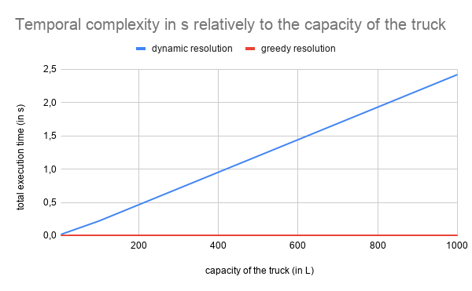

# Algorithms in Logistics : the KnapSack Problem

## Context and introduction 
The knapSack problem is a very famous problem of combinatorial optimization as it is one of the 21 NP-complete problems presented by Richard Karp in 1971 . 

It appears in many situation in transport and logistic and can be illustrated by the following example : 

A logistic company wants to optmize its shipments. To do so, it has to choose among 
several items (each having their own value and volume) a subset of items fitiing in 
the cargo truck while maximising the value of the shipment.

To give a concrete example, *what would be the optimal subset for the following group of items if the maximal capacity of the cargo truck is 15 L?*

| id                | A | B | C | D  | E  | F | G  |
|-------------------|---|---|---|----|----|---|----|
| values (in euros) | 7 | 9 | 5 | 12 | 14 | 6 | 12 |
| volumes (in L)     | 3 | 4 | 2 | 6  | 7  | 3 | 5  |

## First approach 

The first approach I had has been to quantify how profitable each items were. Intuitively, it is easy to say that the item F is more profitable than the item A
as it has more value for the same volume. Therefore, the quantifier I used was the ratio **value/volume** so I sorted the items from the higher ratio to the lowest.

| id            | C   | G   | A   | B    | D | E | F |
|---------------|-----|-----|-----|------|---|---|---|
| ratio   (€/L) | 2.5 | 2.4 | 2.3 | 2.25 | 2 | 2 | 2 |

Once sorted, I only had to add the first volumes until there was no room left for a new item's volume in the imaginary cargo.
This is when I noticed a limit of this method or at least for its implementation. Indeed, after summing the volumes of the items C,G,A and B,
I ended up with a __total volume of 14L and a total value of 33 euros__. But if I had swapt the items C and F, I would have ended up with a __total volume of 15L and a 
total value of 34 euros__. 
It was obvious that the algorithm was not capable of giving the optimal solution. 

## Complexity Analysis 
### Greedy algorithm resolution 
This first intuition is indeed close to the greedy algorithm's resolution of this problem which makes locally optimal solution. 
Therefore, it is higly dependent of the volumes' value and if their sum is equal to the cargo truck capacity. 

Moreover, to implement this algorithm, I have to sort the ratio's array first. 
To do so, I used the python's built-in function "sorted" of temporal complexity equal to O(nlog(n)), where n is the number of items.
Then in the second part, the loop goes at most over all the items which correspond to a O(n) complexity. 
Therefore, the **temporal complexity of the algorithm is O(nlog(n))**. 


Regarding the spatial complexity, only an array of length n needs to be created in order to keep track of the ratios. 
Thus, the **spatial complexity of the algorithm is O(n)**. 

To have a reliable solution to this problem, the greedy algorithm resolution is not satisfying as it can not guarantee to give the optimal result. I have still decided to
implement it in order to compare its results with the dynamic programming'ones.  

### Dynamic Programming resolution

To explain the second method used, let's get back to the definition of the dynamic programming. The principle of this method is to break down a problem in several sub-problems. Then, solving the problem is equivalent to get the resolution of the sub-problems it is composed of.
The resolution of the sub-problems are stored in 
memory in order to access them easily, without recomputing them every times. 

In our case, this method is applied as following : let's consider a cargo truck of capacity C and a list of items of length N. Finding the optimal subset for the combinaison
(N,C) is similar to get the subset for the combinaison (N-1,C) and see if any of the remaining items could fit in the cargo truck. If so, the item will be added to the 
optimal subset and the total value of the shipment will be increased by the item's value. If the item does not fit, the optimal subset for (N,C) is the same than (N-1,C). 

Because we have to loop over all the N items for each capacity between 1 and C, the **temporal complexity of the algorithm is O(NC)**. To store all the sub maximum, we need to construct a N-by-C matrix as explained above so the **spatial complexity of the algorithm is O(NC)**. 

There is no need to compare both methods'complexities as the Dynamic Programming resolution offers an optimal subset whereas the greedy algorithm is only able to compute a locally optimal solution. 

## Implementation 

Pseudo code for the greedy algorithm :
```
Sort the volumes and the values from the highest ratio value/volume per item to the lowest. 

// Make sure that the next item will fit before adding it 

While sum_volume + next_item_volume <= total_capacity

  sum_volume += next_item_volume 
  
  sum_value += next_item_value 
  
  increase next_item
  
  add current item to the subset 
  
return subset,sum_value,sum_volume
```

Pseudo code for the dynamic programming : 
``` 
// Build the matrix with the maximum for each couple (N,C) 

For each item from 0 to N
  For each capacity between 0 and C
    // Does the item fit ?
    if item_volume > capacity 
      stored_max[item][capacity] = stored_max[item-1][capacity] 
    else 
      // Is the item kept or not ?
      stored_max[item][capacity] = max(stored_max[item-1][capacity],stored_max[item-1][capacity-item_volume] + item_value)
```

In this pseudo code, we can see that getting the value ```stored_max[N][C]``` will return the maximum value for the shipment of capacity C and N items. But then,
it is not possible to know which subset of items will lead to the optimal combinaison. 
That is why I added a loop to get this subset. To do so, it is necessary to reverse the logic implemented in the construction of the stored_max matrix but also to store when
an item has been added to a subset. 

If we assume that the added items for the couple (item,capacity) are stored in a kept_items matrix, the loop to get back to the subset function look like this : 

```
  capacity = C 
  for item in 0 to N 
    if kep_item[item][capacity] is True 
      add item to subset 
      capacity = capacity - item_volume // What volume is left once we know that item belongs to the subset 
```
In addition, we can keep track of the sum of all the item's volume to know the total volume of the shipment. 

## Discussions 

Once both algorithms had been implemented, I wanted to test their temporal performances and see if it matched the theoretical expectations. 

To do so, I used the [timeit function](https://documentation.help/Python-3.7/timeit.html) for each algorithm over 1000 executions. To confirm that the greedy algorithm's temporal complexity was only sensitive to the number of items whereas the dynamic programmation algorithm'one was sensitive to both the number of items and the capacity of the truck, I plotted the total execution time for both the algorithm. The first plot represent both temporal complexity when the capacity is fixed at 10 L and the number of items is varying and in the second the number of items is fixed at 100 while the capacity is varying. 




Those plots are confirming our theoretical expectations. 

In light of the temporal complexity's difference relatively to the number of items, I wonder if it could be interesting to use the greedy resolution rather that the dynamical one when the number of items and/or the capacity are really big. 

To be able to answer this question, I needed to quantify the loss that might occur when the greedy algorithm will return a suboptimal susbet and how often would it happen. This is why I created the ```test_accuracy``` function in which I generate a random dataset of 1000 items and I fix the capacity of the truck at 50L. Then, I made the difference between maximum value returned by the greedy and the dynamic programming algorithm and I sum the error between the two. This is executed 1000 times and considering that the dynamical programming algorithm always find the maximum value, I can tell how often did the greedy algorithm found a different value. Finally, by summing the errors over the 1000 executions and dividing by the number of time the values were different, I could have the mean loss in percentage of the total value of the shipment. 

For 1000 items and a capacity of 50L, the greedy algorithm got the optimal subset 795 times (~80% of the time) and when it did not, the relative error was about 1,29 % of the optimal value of the shipment. 

This could let us think that in a configuration where a large amount of items is available for a relatively small capacity, using greedy algorithm over dynamical programming algorithm might be significantly faster and will not lead to such a big loss in terms of value of the shipment. 

Nevertheless, this is not true for every (capacity, nb_of_items) couples and also depends on the items'volume. As an example, if we have 50 items and a capacity of 50 L, the greedy algorithm got the optimal subset 231 times (~23% of the time) and when it did not, the relative error was about 2,84 % of the optimal value of the shipment. 

In this case, choosing the greedy algorithm would not be interesting. 

## Sources 
[The Wikipedia page](https://en.wikipedia.org/wiki/Knapsack_problem)

[Different implementations from geeks for geeks](https://www.geeksforgeeks.org/0-1-knapsack-problem-dp-10/)

[Explanation of the Dynamical Programming resolution](https://dev.to/downey/solving-the-knapsack-problem-with-dynamic-programming-4hce)

[Lecture on the KnapSack problem](http://www.es.ele.tue.nl/education/5MC10/Solutions/knapsack.pdf)
